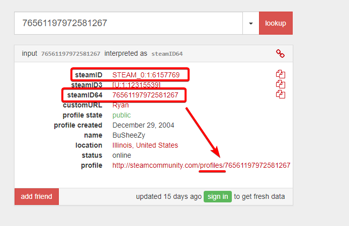

# ***Tarik.GG | Admin Info***

## **Banning**

**Primary Method:** Use /ban or !ban in game, must choose ban length and reason

- **`!ban <#userid|name> <minutes|0> [reason]`** - Bans a client for a specified amount of time with an optional reason. (time in minutes, 0 is a permanent ban)

**Alternate Method:** Use the website to ban a client using their SteamID or SteamID64

- **Video on how to ban from website [35s]** [https://youtu.be/rzubDUGmRME](https://youtu.be/rzubDUGmRME)
- **Website (must be logged in):** [https://bans.tarik.gg](https://bans.tarik.gg/)

>**You can find both the SteamID and the SteamID64 on [https://steamid.io/](https://steamid.io/) either will work if you are banning a player from the website.**

## **Rules/Punishments**

| *INFRACTION* | *PUNISHMENT* |
|--|--|
| **Cheating/Scripting** | Instant and permanent ban |
| **Racism, Harassment, Racial Slurs** | 1-7 days (permanent ban if multiple offenses) |
| **Trolling/Griefing/Mic or Chat Spam** | Not to exceed a week ban |
| **Throwing/Intentionally Losing** | 2hr - 1 day ban (admin discretion) |
| **Ignoring Objective** | 2hr - 1 day ban (admin discretion) |
| **Admin Disrespect/Harassment** | Not to exceed a week ban |
| **Advertisement** | Kick/Warning - 1 day ban |
| **Disruptively High Ping (>210)** | Move to spectators & inform player |

## **Useful Chat Commands**

- **`!claim` or `/claim`** - Notifies other admins in discord that you’re handling a report. Claim messages are sent in the #game-admins channel
- **`!ban <#userid|name> <minutes|0=permanent> [reason]`** - Bans a client for a specified amount of time
- **`!kick <#userid|name> [reason]`** - Kicks a specified client with the option to append a message
- **`!admin`** - Displays the admin menu
- **`!silence <target(s)>`** - Performs both a “gag” and “mute” on the target(s).
- **`!unsilence <target(s)>`** - Performs both an “ungag” and “unmute” on the target(s).
- **(Team Chat) `@` before message** - Sends message to admins in chat

## **Additional Console Commands**

>**Additional note about usage:** Commands do not have to be entered through the console; they can be entered via chat triggers. For example, saying `!ban bail` in chat will execute the same command as `sm_ban` and forward the output to chat. You can also use `/` instead of `!` to suppress your command from being shown to users.

- **`status`** - Allows you to see the Steam ID of every person in the server, useful for global bans
- **`sm_admin`** - Displays the admin menu
- **`sm_ban <#userid|name> <minutes|0=permanent> [reason]`** - Bans a client for a specified amount of time.
- **`sm_unban <#userid>`** - Unbans the player from the server
- **`sm_kick <#userid|name>`** [reason] - Kicks the player from the server
- **`sm_gag <#userid|name>`** - Removes the player's ability to use text chat
- **`sm_ungag <#userid|name>`** - Restores the player's ability to use text chat
- **`sm_mute <#userid|name>`** - Removes the player's ability to use voice chat
- **`sm_unmute <#userid|name>`** - Restores the player's ability to use voice chat
- **`sm_silence <#userid|name>`** - Removes the player's ability to use voice and text chat
- **`sm_unsilence <#userid|name>`** - Restores the player's ability to use voice and text chat
- **`sm_psay <#userid|name> <message>`** - Sends a private message
- **`sm_chat <message>`** - Sends a message to all staff on the server
- **`sm_say <message>`** - Sends a message to all players in chat
- **`sm_tsay [color] <message>`** - Sends a top-left message to all players. If no color specified then the text is white. Available colors: white, red, green, blue, yellow, purple, cyan, orange, pink, olive, lime, violet, lightblue (not case-sensitive)
- **`sm_vote <“question”> <“Answer 1”> <“Answer 2”>…<“Answer 5”>`** - Calls a vote. Put each in quotes
- **`sm_who`** - Lists all users and their access rights, or a specific user's access rights. Useful for checking a players name or checking if other admins are on.

***Shortcuts (in place of <#userid|name> parameter):***

- **`@spec`** - targets all spectators
- **`@t`** - targets all terrorists
- **`@ct`** - targets all counter terrorists
- **`@me`** - targets yourself
- **`@!me`** - targets everyone but yourself
